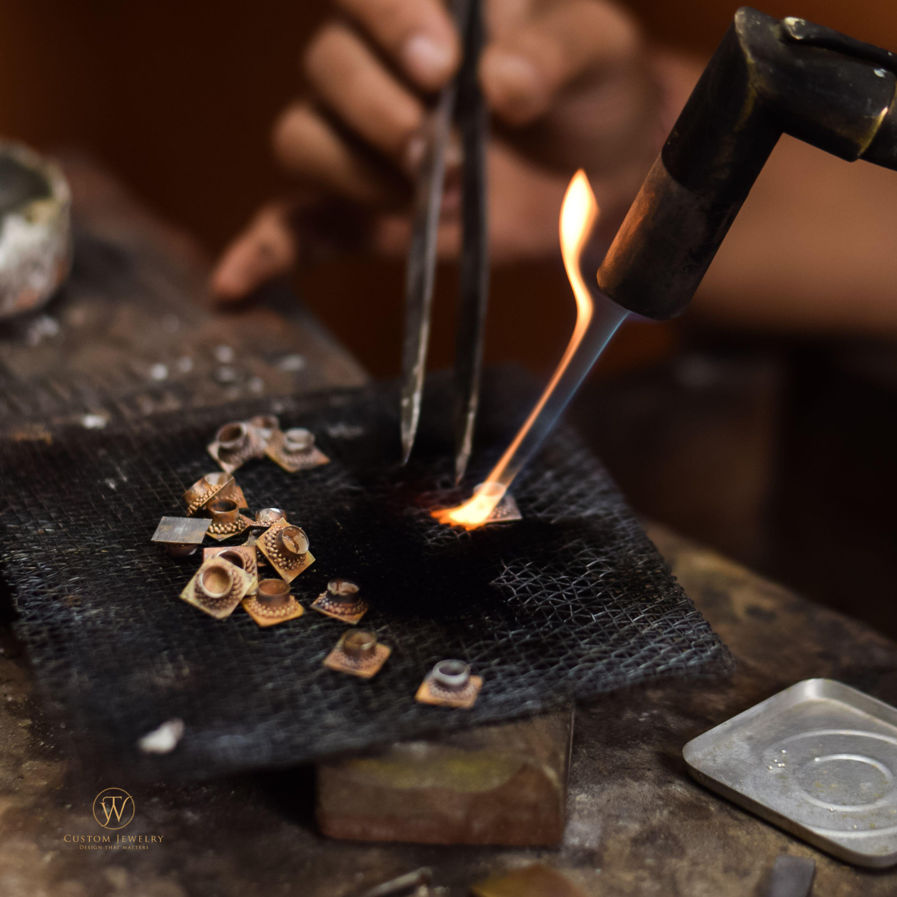

# Custom By Thu Win — How to Update Your Website

## Quick Setup

### 1. Replace the Hero Video
- Drop your video file into the `video/` folder and name it `hero.mp4`
- That's it — the video will auto-play, muted, and loop on the homepage.
- For a fallback poster image, add `img/hero-poster.jpg`

### 2. Add Your About Photo
- Save your photo as `img/about.jpg`
- In `index.html`, find the `about-img-placeholder` div and replace it with:
  ```html
  
  ```

### 3. Add Portfolio Items
- Save your photos to `img/portfolio/` (e.g., `ring-01.jpg`)
- Find a `portfolio-card` block in `index.html`
- Replace the placeholder div with your image:
  ```html
  
  ```
- For VIDEO portfolio items, use:
  ```html
  <video autoplay muted loop playsinline>
    <source src="video/portfolio-ring.mp4" type="video/mp4" />
  </video>
  ```
- Update the title, description, and tags below each card.
- To add more cards, copy a full `<div class="portfolio-card reveal">` block.

### 4. Connect Instagram (Free Widget)
1. Go to https://behold.so OR https://elfsight.com/instagram-feed-widget/
2. Create a free account and connect your Instagram
3. Copy the embed code they give you
4. In `index.html`, find the comment `PASTE YOUR INSTAGRAM WIDGET EMBED CODE HERE` and paste it there

### 5. Set Up the Appointment Form (Free Email Receiving)
1. In `index.html`, find this line:
   ```
   action="https://formsubmit.co/YOUR_EMAIL@gmail.com"
   ```
2. Replace `YOUR_EMAIL@gmail.com` with your actual email
3. Submit the form once — FormSubmit will send you a confirmation email to activate

### 6. Add More Timeline Steps
Find the comment in `index.html` that says `ADD MORE STEPS BELOW THIS COMMENT`
Copy and paste a full `timeline-item` block and update the content.

### 7. Update Social Links
Search for `instagram.com/CustomByThuWin` in `index.html` and replace with your actual Instagram URL.
Do the same for Facebook, Pinterest, TikTok links in the footer.

---

## File Structure
```
project Custom By Thu Win/
├── index.html          ← Main website (edit content here)
├── style.css           ← All styling (colors, fonts, layout)
├── script.js           ← Animations, mobile menu, lightbox
├── img/
│   ├── hero-poster.jpg ← Fallback image for video hero
│   ├── about.jpg       ← Your photo for the About section
│   └── portfolio/      ← Portfolio images go here
│       ├── ring-01.jpg
│       └── ...
└── video/
    ├── hero.mp4        ← Hero background video
    └── ...             ← Portfolio videos (optional)
```

## Brand Colors
- Gold:       #c9a96e
- Dark gold:  #a07840
- Black:      #080808
- Dark:       #111111

To open the website, simply double-click `index.html` in your file explorer.
